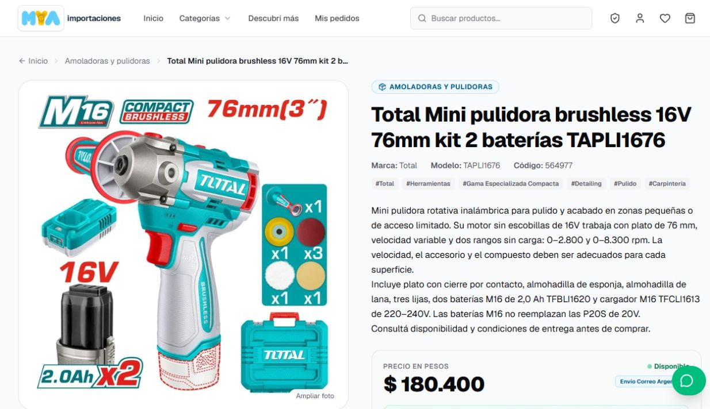

# Herramientas publicadas por rubro — 06/10/2026

Se publicaron 13 opciones: 9 productos nuevos y 4 borradores activados. Además, se completaron las gamas y los rubros de 6 productos que ya estaban publicados, conservando sus precios.

| Rubro | Producto / modelo | Gama | Precio ARS |
| --- | --- | --- | ---: |
| Detailing y limpieza | [Wadfow WHP3A14, hidrolavadora 1400W 110bar](https://myaimportaciones.vercel.app/producto/wadfow-hidrolavadora-1400w-110bar-whp3a14) | Entrada | 141.900 |
| Detailing y limpieza | [Total TGT11316, hidrolavadora 1400W 130bar](https://myaimportaciones.vercel.app/producto/total-hidrolavadora-1400w-130bar-tgt11316) | Entrada Total | 216.600 |
| Detailing y limpieza | [Total TGT11376, hidrolavadora 2000W 160bar](https://myaimportaciones.vercel.app/producto/total-hidrolavadora-2000w-160bar-tgt11376) | Intermedia | 278.100 |
| Detailing y limpieza | [Total TGT11226, hidrolavadora 2000W 150bar](https://myaimportaciones.vercel.app/producto/total-hidrolavadora-de-induccion-2000w-150bar-tgt11226) | Superior, motor de inducción | 414.100 |
| Detailing y limpieza | [Total TVC14122, aspiradora seco/húmedo 12L 800W](https://myaimportaciones.vercel.app/producto/total-aspiradora-seco-y-humedo-12l-800w-tvc14122) | Entrada compacta | 168.300 |
| Detailing y pulido | [Total TAPLI1676, mini pulidora 16V 76mm](https://myaimportaciones.vercel.app/producto/total-mini-pulidora-brushless-16v-76mm-kit-2-baterias-tapli1676) | Especializada compacta, dos baterías y cargador | 180.400 |
| Carpintería | [Total TL7508226, cepillo 750W 82mm](https://myaimportaciones.vercel.app/producto/total-cepillo-electrico-para-madera-750w-82mm-tl7508226) | Entrada con cable | 124.300 |
| Carpintería | [Total TRLI20401, cepillo 20V 82mm](https://myaimportaciones.vercel.app/producto/total-cepillo-inalambrico-para-madera-20v-82mm-sin-bateria-trli20401) | Intermedia inalámbrica, sin batería ni cargador | 195.300 |
| Carpintería, instalaciones y mantenimiento | [Total TMLI2022, multiherramienta oscilante 20V](https://myaimportaciones.vercel.app/producto/total-multiherramienta-oscilante-20v-sin-bateria-tmli2022) | Intermedia versátil, sin batería ni cargador | 96.700 |
| Herramientas inalámbricas | [Total TFBLI20021, batería 20V P20S 4Ah](https://myaimportaciones.vercel.app/producto/total-bateria-p20s-20v-4ah-tfbli20021) | 4Ah, cargador aparte | 72.300 |
| Instalaciones y construcción | [Total TLL156601, nivel verde 2 líneas 35m](https://myaimportaciones.vercel.app/producto/total-nivel-laser-verde-2-lineas-35m-tll156601) | Entrada | 120.500 |
| Instalaciones y construcción | [Total TLL306502, nivel verde 360° 35m](https://myaimportaciones.vercel.app/producto/total-nivel-laser-verde-360-35m-tll306502) | Intermedia 360° | 145.800 |
| Electricidad y mantenimiento | [Total TMT5110004, multímetro Smart True RMS](https://myaimportaciones.vercel.app/producto/total-multimetro-smart-true-rms-1000v-9999-cuentas-tmt5110004) | Avanzada Smart | 83.600 |

Las opciones nuevas complementan las lustradoras/pulidoras TOPLI202548 y TAPLI2015, las aspiradoras de 30 y 35 litros WVR2A30 y WVR4A35, las fresadoras TR111216 y TR111226 y el nivel profesional TLL3012165 que ya estaban publicados. Las fichas diferencian capacidad, aplicación y kit; una mini pulidora especializada no reemplaza una pulidora de mayor diámetro.

Los precios de esta tanda siguen el criterio de referencia argentina exacta menos 10%, redondeado hacia abajo a $100. Para la TGT11376 se usó el precio general de [GSMART](https://gsmartherramientas.com.ar/productos/hidrolavadora-total-2000w-160-bar/), más competitivo que la oferta de Mercado Libre disponible. Se excluyeron precios sin impuestos, descuentos condicionados, combos diferentes y referencias agotadas.

Se revisaron 59 fichas del proveedor. Las opciones sin stock, sin referencia argentina suficiente o con dudas de versión/kit quedaron pendientes. Entre ellas están los equipos de lavado industriales grandes, varias pulidoras de 180mm y 42V, las aspiradoras grandes de Total, los accesorios TAC15012/TACB1101 y el compresor de 24L con diferencias de versión en las referencias disponibles.

La publicación conserva el stock propio sin confirmar y usa disponibilidad del proveedor. Las aspiradoras de seco/húmedo no se describen como inyectoras-extractoras, y las hidrolavadoras de esta tanda no prometen funcionamiento industrial continuo.

## Verificación en producción

- 234 productos totales; 193 activos.
- 19 fichas públicas afectadas verificadas con nombre, gama, precio y foto optimizada decodificable.
- 19 imágenes de la nueva tanda decodificadas e inspeccionadas.
- Búsquedas públicas de hidrolavadoras, cepillos, niveles, mini pulidora, multiherramienta y multímetro verificadas.
- Catálogo de hidrolavadoras y ficha de mini pulidora revisados a 1280px; ficha de mini pulidora y catálogo de cepillos revisados a 390px, sin desbordamiento horizontal.
- Sin duplicados de modelo, SKU o slug; productos ajenos a la tanda y sus costos preservados; 50 categorías preservadas.
- Sin cambios de código de la tienda ni despliegue de aplicación. Publicación de datos verificada en la URL de producción.

Los costos de compra, las cotizaciones del proveedor y las diferencias previas a gastos se conservan en evidencia privada local y en la tabla privada de costos. No se reportan como ganancia neta.

